<div align="center">
  
  
  <br />
  
  

  <br />
  <br />

  
  
  
  
  

  <br />
  <br />
  
  <em>"I am not going to stop the wheel. I am going to break the wheel."</em>
  <br/>
  <b>— Daenerys Targaryen</b>

</div>

<br />

## Project Architecture & Overview

Welcome to the **Game of Thrones Universe**, a deeply immersive, visually stunning, and **fully scrollable** web application. This project is meticulously engineered to provide a cinematic journey through the lore of Westeros without ever requiring the user to click a navigation link. Every scene transitions seamlessly through scroll-driven interactions.

### Technical Deep Dive
- **Scroll-Driven Physics:** The core engine of this application relies on **GSAP** and the **ScrollTrigger** plugin. The entire DOM is pinned while background images, foreground elements, and typography are dynamically scaled and opacity-faded mathematically based on scroll progress.
- **WebGL Particle Rendering:** The floating embers, frost particles, and background stardust are rendered using a 3D canvas context provided by **@react-three/fiber**. The `<Particles />` component leverages mathematical sine waves to rotate the 3D space, creating a dynamic parallax effect that feels truly alive.
- **Cinematic Styling:** No CSS libraries were used. The application relies purely on custom, vanilla CSS utilizing complex `calc()`, `clamp()`, and viewport units (`vh`, `dvh`, `vw`) to ensure the mathematical scroll distance directly correlates to exactly 7 viewports for a flawless 1-to-1 scroll ratio.

---

## Interactive Components

<details>
  <summary><b>The Hero Scene (Scroll Engine)</b></summary>
  <br />
  The `Hero.jsx` component acts as the main scroll engine. It uses an array of majestic background images (The Wall, The Iron Throne, Dragonstone) and crossfades them using a localized progress algorithm derived from the `useFrame` hook in Three.js and GSAP pinning.
</details>

<details>
  <summary><b>The Great Houses (Hover Physics)</b></summary>
  <br />
  The `Section1.jsx` component displays interactive House cards. We use `IntersectionObserver` for staggered reveal animations on scroll. Upon hovering over a card, custom bounding-client mathematical calculations tilt the sigils in 3D space (`rotateX`, `rotateY`) based on cursor position.
</details>

<details>
  <summary><b>The Characters Roster</b></summary>
  <br />
  The `Characters.jsx` component handles an expanding roster of key characters. It uses an active-state toggle mechanism wrapped in golden aesthetic borders with smooth CSS transition scaling.
</details>

---

## Enter Westeros (Run Locally)

To begin your journey into the Seven Kingdoms locally, follow these commands:

```bash
git clone https://github.com/Premhari-7/GAME-OF-THRONES-UNIVERSE.git

cd GAME-OF-THRONES-UNIVERSE

npm install

npm run dev
```

Open your browser to `http://localhost:5173` to view the realm.

---

## License & Authorship

**Created, engineered, and maintained by [Prem Hari](https://github.com/Premhari-7)**

This project is open-sourced under the MIT License. See the `LICENSE` file for details.
