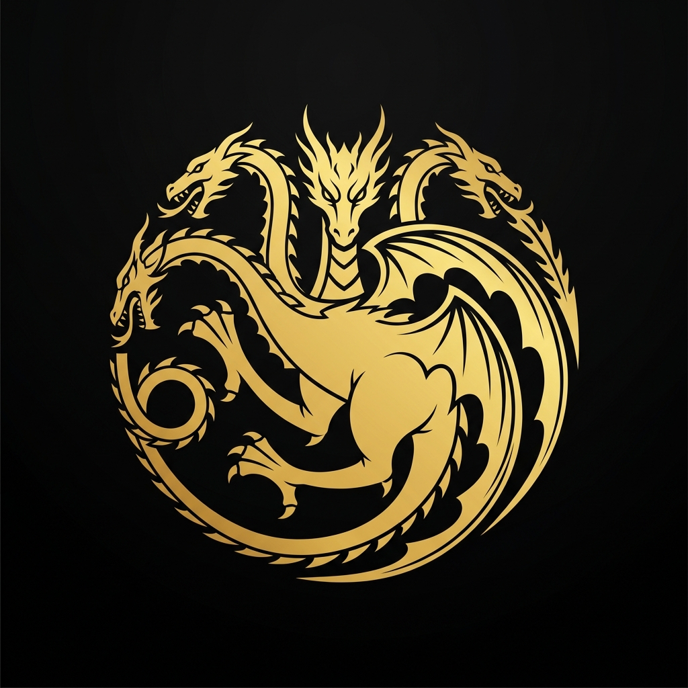

<div align="center">

  

  <br />

  

  <br />

  

  <br />

  

  <a href="#"></a>
  <a href="#"></a>
  <a href="#"></a>
  <a href="#"></a>
  <a href="#"></a>

  <br />

  

</div>

<br />

<div align="center">
  
</div>


<div align="center">
  
</div>

**Game of Thrones Universe** is a deeply immersive, visually stunning, and **fully scroll-driven** web experience that brings the world of Westeros to life. No button clicks needed -- just scroll. Every scene transitions seamlessly through cinematic crossfades, 3D particle physics, and mathematical scroll-progress algorithms.

This is not a standard webpage. It is an interactive journey through the lore of the Seven Kingdoms, engineered for maximum visual impact.


<div align="center">
  
</div>

<table>
  <tr>
    <td width="50%">
      <h3></h3>
      <p>The core of the application is powered by <b>GSAP ScrollTrigger</b>. The entire viewport is pinned while background images, text, and 3D particles are mathematically crossfaded based on scroll progress across 7 full viewport heights.</p>
    </td>
    <td width="50%">
      <h3></h3>
      <p>Golden embers and frost particles are rendered in real-time WebGL using <b>@react-three/fiber</b>. The particle field rotates using sine-wave mathematics, creating a living, breathing parallax atmosphere.</p>
    </td>
  </tr>
  <tr>
    <td width="50%">
      <h3></h3>
      <p>Each House card uses <b>IntersectionObserver</b> for staggered reveal animations. On hover, bounding-client calculations tilt the sigils in 3D space (<code>rotateX</code>, <code>rotateY</code>) based on cursor position.</p>
    </td>
    <td width="50%">
      <h3></h3>
      <p>Zero CSS frameworks. Every style is hand-written vanilla CSS using <code>clamp()</code>, <code>calc()</code>, and viewport units (<code>dvh</code>, <code>vw</code>) for pixel-perfect responsiveness across all devices.</p>
    </td>
  </tr>
</table>


<div align="center">
  
</div>

<details>
  <summary></summary>
  <br />
  Six full-screen scenes (The Ancient Chronicles, The Seven Kingdoms, The Wall, The Iron Throne, Fire and Blood, The Long Night) crossfade with mathematically interpolated opacity and scale transforms. A 3D canvas overlay renders thousands of floating star particles and golden sparkles in real-time.
  <br /><br />
</details>

<details>
  <summary></summary>
  <br />
  Nine Great Houses of Westeros displayed in an animated grid. Each card features the House sigil, seat, region, and words. On hover, the card reveals a detailed lore description with 3D tilt physics applied to the sigil image.
  <br /><br />
</details>

<details>
  <summary></summary>
  <br />
  A curated roster of iconic characters with expand-on-click biography panels. Styled with golden borders and cinematic typography.
  <br /><br />
</details>

<details>
  <summary></summary>
  <br />
  Scroll-triggered lore panels with parallax imagery covering dragons, battles, and the deep history of Westeros.
  <br /><br />
</details>

<details>
  <summary></summary>
  <br />
  An interactive heart that transitions between ice (frozen) and fire (ignited) states on click, with animated ice shards, fire sparks, and glowing embers.
  <br /><br />
</details>


<div align="center">
  
</div>

```bash
# Clone the repository
git clone https://github.com/Premhari-7/GAME-OF-THRONES-UNIVERSE.git

# Enter the gates of Westeros
cd GAME-OF-THRONES-UNIVERSE

# Gather your bannermen (Install dependencies)
npm install

# Light the pyres (Start the dev server)
npm run dev
```

Open `http://localhost:5173` in your browser to enter the realm.


<div align="center">
  
</div>

This project is open-sourced under the **MIT License**. See the [LICENSE](LICENSE) file for details.


<div align="center">
  
</div>

> **Disclaimer and Copyright Notice**
>
> *Game of Thrones* is a registered trademark of **HBO** and **Warner Bros. Discovery**. The television series *Game of Thrones* (2011-2019) was created by **David Benioff** and **D.B. Weiss**, based on the novel series *A Song of Ice and Fire* by **George R.R. Martin**.
>
> All character names, house sigils, lore references, and imagery from the series are the intellectual property of HBO, Warner Bros. Discovery, and George R.R. Martin. This project uses publicly available promotional images and references from the television series for **non-commercial, educational, and fan-project purposes only**.
>
> This web application is an **unofficial fan project** and is not affiliated with, endorsed by, or connected to HBO, Warner Bros. Discovery, or George R.R. Martin in any way. No copyright infringement is intended.

<br />

<div align="center">

  

  <br />

  

  <br />

  

  <br />

  

</div>
